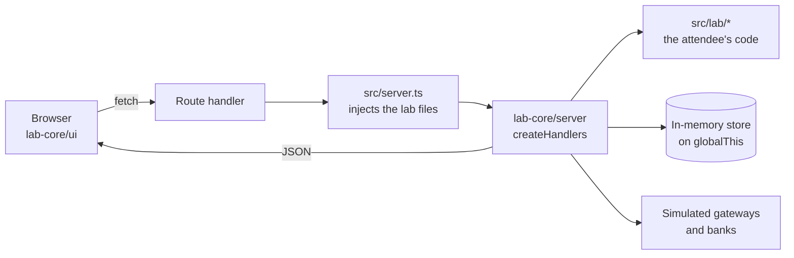

# AGENTS.md

Shared guide for AI assistants working in this repository. Tool-agnostic. `CLAUDE.md`
imports this file and adds Claude Code specifics.

Nothing here is required to do the exercises. An attendee with no assistant should have the
same experience.

## What this repository is

The exercise repository for **Payments and Monetization at Scale for Frontend Engineers** by
Faris Aziz. Two labs, 25 minutes each, for frontend, full-stack and lead engineers. Payments
knowledge is not assumed.

**Lab 1, the game day.** Bigpdf takes payments across five segments of method, country and
currency, routed to three gateways by an orchestrator. Somebody injects a fault into one
gateway for one segment, and the overall success rate barely moves while that segment dies.

**Lab 2, the grace period.** Billing suspends an account a day after the invoice was due.
The payment was a SEPA direct debit and the money is still in flight, because the grace
period was written for cards and applied to a rail that answers five business days later.

## Two modes

**Attendee tutor is the default.** Assume you are talking to someone doing an exercise.

- Ask what they observed before offering anything: which lab, what the console said, which
  account or segment.
- Help them reproduce it. Both consoles poll the server independently of the attendee's
  code, so they keep telling the truth.
- Give hints in order, one level at a time, from the `HINTS.md` inside the starter.
- **Do not complete the tasks.** Do not paste a working `chooseGateway`, `planRetry`,
  `graceWindowFor` or `decideDunning`.
- **Do not read the reference to them**, quote it, or diff the starter against it.
- **Never edit anything under a `*.solution.*` directory.**
- Give a direct answer only when the attendee explicitly asks for one. Then give it, explain
  it, and move on.

**Maintainer mode is opt-in.** Enter it only on an explicit request, and say so in one line.
Then you may implement changes, run every check, compare the two apps, and update materials.

Unsure which mode you are in? You are in tutor mode.

## The starters are deliberately wrong

Each starter has behavioural bugs, one per file in its `src/lab/`. They are not listed here
on purpose: this file is public, and naming them hands an attendee the exercise.

Find them the way an attendee does, by running the lab and watching the console. They are
behavioural, never type errors, so every starter type checks, lints and builds. A bug a
compiler could catch would teach nothing about payments.

## Architecture

```
packages/lab-core/              shared, consumed as TypeScript source
  src/contracts/                types shared by client and server. Safe everywhere
  src/server/                   store, gateways, traffic, health, orchestrator,
                                billing, HTTP handlers. Server only
  src/ui/                       Radix Themes components, design system, API client, hooks
exercises/01.game-day/
  01.problem.game-day/          starter    (3001)
  01.solution.game-day/         reference  (3002)
exercises/02.grace-periods/
  02.problem.grace-periods/     starter    (3003)
  02.solution.grace-periods/    reference  (3004)
```



Every app is Next.js 16 App Router on React 19. **Routing and dunning are server
decisions**, so each app's `src/server.ts` injects its own `src/lab/` functions into the
shared handlers through `createHandlers` or `createBillingHandlers`. A starter and its
reference share one server and differ only in those lab files.

**The three entry points matter.** `@bigpdf/lab-core/server` owns the in-memory store and
must never reach a client bundle. `@bigpdf/lab-core/ui` is `'use client'` code.
`@bigpdf/lab-core/contracts` is safe in both.

**State lives in memory**, on `globalThis` so it survives hot reloads, using plain objects
and Maps because a class instance would fail `instanceof` after a module reload. Restarting
the dev server clears everything.

**The interface is Radix Themes.** Do not hand-write CSS and do not add another component
library. The design decisions live in `packages/lab-core/src/ui/theme.ts` and the theme is
applied once in `Shell`. The only stylesheet is `packages/lab-core/src/ui/app.css` and it
should stay about twenty lines.

**The lab files are pure functions.** They take plain values and return plain values. Keep
it that way. A component in an exercise file means an attendee spends the 25 minutes on
markup instead of payments.

**Nothing is random.** Lab 1's traffic comes from a seeded generator and lab 2 has an
explicit clock. A failure an attendee saw must be a failure you can reproduce.

## Commands

| Command | Notes |
| --- | --- |
| `pnpm install` | Once. Never from inside the runner |
| `pnpm exercise 01` / `pnpm solution 01` | `01` and `02`. `--port` beats `PORT` |
| `pnpm compare 01` | Both, separate state |
| `pnpm reset 01` | Clears server state without a restart |
| `pnpm test` | Unit plus behaviour against the references. **Must pass** |
| `pnpm test:exercise 01` | Behaviour against a starter. **Expected to fail**, exits 0 |
| `pnpm e2e` / `pnpm e2e:exercise` | Playwright, one app at a time. References must pass |
| `pnpm check` | Typecheck, lint, test and build |

## Contracts

Read [`docs/payment-contracts.md`](./docs/payment-contracts.md). It has the failure
taxonomy, the routing rules, the two rails and the dunning policy, with diagrams. Do not
restate it here, because two copies drift.

## Verification rules

- Every app type checks, lints and builds **with the bugs in place**.
- `pnpm test` passing and `pnpm test:exercise` failing is the correct state of a fresh
  checkout. Never "fix" a starter to make the second pass.
- A starter never imports from its reference, and the two differ only in `src/lab/` plus
  `app/layout.tsx`. `scripts/check-boundaries.mjs` enforces that, and that lab-core never
  imports from an exercise.
- Every `pnpm` command and relative path named in a markdown file must exist.
  `scripts/check-docs.mjs` enforces that.
- Nothing may require network access after install, or any credential.

## Boundaries

- Never edit a reference app unless you are in maintainer mode and were asked to.
- Never commit, push or open a pull request unless asked. Both prompt, and a prompt is not
  permission.
- Never add a dependency to make a hint easier. The labs work offline from the committed
  lockfile.
- No secrets, tokens or `.env` files. Nothing here needs one.
- Do not weaken permissions or approve install hooks to get a command to run.
- If a check fails, say which one and what it printed. Never describe a check you did not run.

## Writing style

Faris's workshop voice: practical, conversational, direct. Emoji on section headings.
Concrete customer scenarios rather than abstractions. Say the uncomfortable part out loud.
Short paragraphs, no padding, and no em dashes. `.claude/skills/workshop-voice/SKILL.md` has
the full rules.
