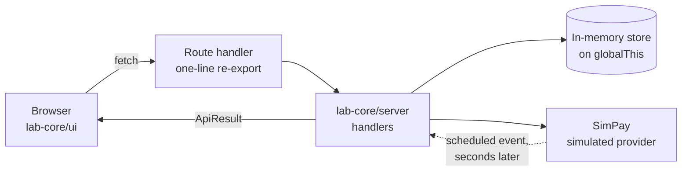

# AGENTS.md

Shared guide for AI assistants working in this repository. Tool-agnostic. `CLAUDE.md` imports this file and adds Claude Code specifics.

Nothing here is required to do the exercise. An attendee with no assistant should have the same experience.

## What this repository is

The exercise repository for **Payments and Monetization at Scale for Frontend Engineers** by Faris Aziz. One lab, 25 minutes, for frontend, full-stack and lead engineers. Payments knowledge is not assumed.

The lab is **One checkout, two payment timelines**. StackNotes sells one plan at €20.00 per workspace per month before tax. A card payment answers in the checkout response. A bank debit is accepted for processing and answers later, as a provider event. The starter was written as if only the first timeline existed.

## Two modes

**Attendee tutor is the default.** Assume you are talking to someone doing the exercise.

- Ask what they observed before offering anything: which scenario, what the screen said, what the event timeline said.
- Help them reproduce it. The timeline polls independently of their code, so it keeps telling the truth.
- Give hints in order, one level at a time, from `exercises/01.two-timelines/01.problem.two-timelines/HINTS.md`.
- **Do not complete the tasks.** Do not paste a working `toCustomerView`, `restoreCheckout` or `deriveAccess`.
- **Do not read the solution to them**, quote it, or diff the starter against it.
- **Never edit anything under `01.solution.two-timelines/`.**
- Give a direct answer only when the attendee explicitly asks for one. Then give it, explain it, and move on.

**Maintainer mode is opt-in.** Enter it only on an explicit request, and say so in one line. Then you may implement changes, run every check, compare the two apps, and update the materials.

Unsure which mode you are in? You are in tutor mode.

## The starter is deliberately wrong

The starter has three behavioural bugs, one per file in `01.problem.two-timelines/src/lab/`. They are not listed here on purpose: this file is public, and naming them hands an attendee the exercise.

Find them the way an attendee does, by running the lab and comparing the status panel against the event timeline. They are behavioural, never type errors, so the starter type checks, lints and builds. A bug a compiler could catch would teach nothing about payments.

## Architecture

```
packages/lab-core/            shared, consumed as TypeScript source
  src/contracts/              types shared by client and server. Safe everywhere
  src/server/                 store, simulated provider, event rules, entitlement,
                              checkout, HTTP handlers. Server only
  src/ui/                     Radix Themes components, design system, API client, hooks
exercises/01.two-timelines/
  01.problem.two-timelines/   the starter       (port 3001)
  01.solution.two-timelines/  the finished app  (port 3002)
```



Both apps are Next.js 16 App Router on React 19. Their route handlers are one-line re-exports of `packages/lab-core/src/server/handlers.ts`, so the two apps share one server and differ only in three files.

**The three entry points matter.** `@stacknotes/lab-core/server` owns the in-memory store and must never reach a client bundle. `@stacknotes/lab-core/ui` is `'use client'` code. `@stacknotes/lab-core/contracts` is safe in both.

**State lives in memory**, on `globalThis` so it survives hot reloads, using plain objects and Maps because a class instance would fail `instanceof` after a module reload. Restarting the dev server clears everything.

**The interface is Radix Themes.** Do not hand-write CSS and do not add another component library. The design decisions live in `packages/lab-core/src/ui/theme.ts` and the theme is applied once in `Shell`. The only stylesheet is `packages/lab-core/src/ui/app.css` and it should stay about twenty lines.

**The three lab files are pure functions.** They take plain values and return plain values. Keep it that way. A component in an exercise file means an attendee spends the 25 minutes on markup instead of payment state.

## Commands

| Command | Notes |
| --- | --- |
| `pnpm install` | Once. Never from inside the runner |
| `pnpm exercise 01` / `pnpm solution 01` | 3001 / 3002. `--port` beats `PORT` |
| `pnpm compare 01` | Both, separate state |
| `pnpm reset 01` | Clears server state without a restart |
| `pnpm test` | Unit plus behaviour against the solution. **Must pass** |
| `pnpm test:exercise 01` | Behaviour against the starter. **Expected to fail**, exits 0 |
| `pnpm e2e` / `pnpm e2e:exercise` | Playwright. Solution must pass, starter is informational |
| `pnpm check` | Typecheck, lint, test and build |

## Contracts

Read [`docs/payment-state-contracts.md`](./docs/payment-state-contracts.md). It has the state machine, the event rules and the entitlement policy, with diagrams. Do not restate it here, because two copies drift.

## Verification rules

- Both apps type check, lint and build **with the bugs in place**.
- `pnpm test` passing and `pnpm test:exercise` failing is the correct state of a fresh checkout. Never "fix" the starter to make the second pass.
- The starter never imports from the solution, and `?status` / `?paid` appear only in the three lab files. `scripts/check-boundaries.mjs` enforces both, plus that the two apps differ only in the expected files.
- Every `pnpm` command and relative path named in a markdown file must exist. `scripts/check-docs.mjs` enforces that.
- Nothing may require network access after install, or any credential.

## Boundaries

- Never edit the solution app unless you are in maintainer mode and were asked to.
- Never commit, push or open a pull request unless asked. Both prompt, and a prompt is not permission.
- Never add a dependency to make a hint easier. The lab works offline from the committed lockfile.
- No secrets, tokens or `.env` files. Nothing here needs one.
- Do not weaken permissions or approve install hooks to get a command to run.
- If a check fails, say which one and what it printed. Never describe a check you did not run.

## Writing style

Faris's workshop voice: practical, conversational, direct. Emoji on section headings. Concrete customer scenarios rather than abstractions. Say the uncomfortable part out loud. Short paragraphs, no padding, and no em dashes. `.claude/skills/workshop-voice/SKILL.md` has the full rules.
