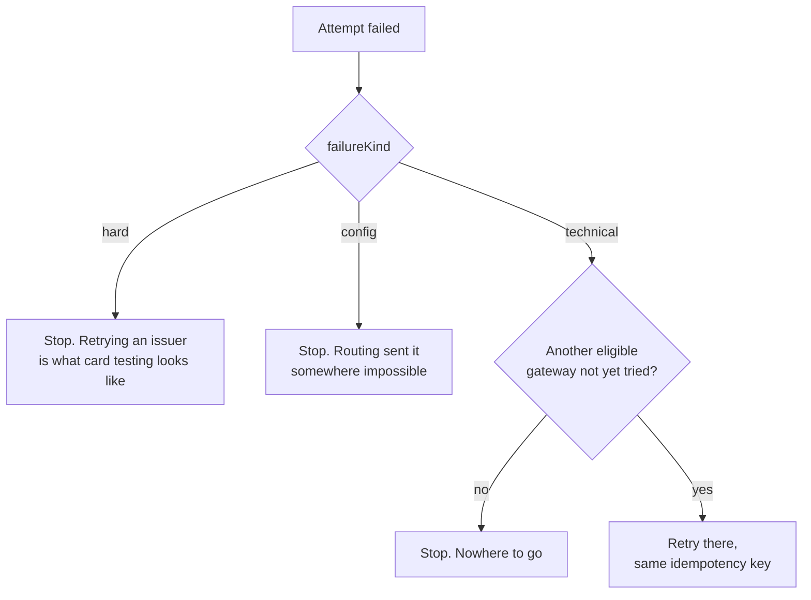
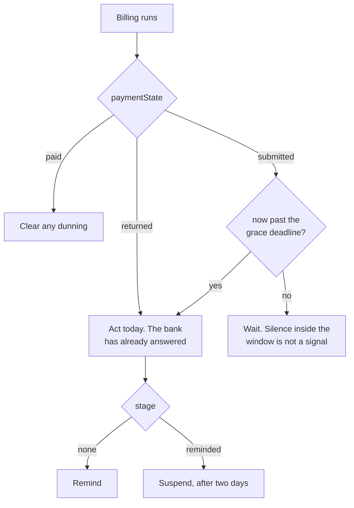

# 📜 Payment contracts

Every type here lives in `packages/lab-core/src/contracts/`. This page explains the
reasoning; the files are the source of truth.

## 🧭 Exercise 01: routing a payment

### Segments

A segment is method, country and currency together. It is the unit failures arrive in, and
the unit an aggregate hides.

```ts
type Segment = { method: 'card' | 'sepa_debit'; country: 'DE' | 'FR' | 'GB'; currency: 'EUR' | 'GBP' };
```

### Gateways are not interchangeable

| Gateway | Accepts | Baseline | Fee |
| --- | --- | --- | --- |
| Atlas | Card EUR, Card GBP | 94% | 1.45% |
| Borealis | Card EUR, SEPA EUR | 92% | 1.20% |
| Cirrus | Card EUR, Card GBP | 88% | 2.10% |

Sterling cannot go to Borealis. SEPA cannot go anywhere else. Routing that checks health
before eligibility produces `unsupported_method`, which is a bug wearing a failure code.

### The failure taxonomy

What kind of failure it was decides what you may do next, and nothing else does.

| Kind | Codes | What you may do |
| --- | --- | --- |
| `hard` | `issuer_declined`, `insufficient_funds`, `expired_card`, `invalid_account` | Nothing. Somebody authoritative said no |
| `technical` | `gateway_unavailable`, `rate_limited` | Retry elsewhere, on the same idempotency key |
| `config` | `unsupported_method` | Fix the routing. This is your bug |

A technical failure in this lab is a gateway turning the request away before it goes near
the money. Nothing is captured and nothing is collected, which is what makes sending the
payment somewhere else a safe thing to do rather than a gamble.



### Health, and the number that lies

`summariseHealth` reports over a rolling 20 second window. A gateway is `degraded` below a
60% success rate, a segment below 70%, and neither is called degraded on a thin sample,
because two failures out of three is not an outage.

The snapshot carries both slices, and picking the wrong one is the second bug this exercise
is built around:

- `snapshot.segments[n].gateways[m]` is one gateway inside one segment. This is the number a
  routing decision is made from.
- `snapshot.gateways[m]` is the same gateway across every segment at once. This is the
  number a status page shows. Atlas refusing German cards drags it down while British cards
  on Atlas are fine, and a policy that reads it moves traffic that was never in trouble.

### Idempotency

The key is how a gateway tells a second attempt at one payment from a second payment. The
simulator enforces it: a key is spent once, and sending the same key again returns the
original capture rather than taking the money a second time.

That means the key belongs to the charge, not to the attempt. A retry that mints a fresh
one hands the gateways three unrelated payments and leaves nobody able to tie them back
together.

One charge, one key, however many attempts it takes.

## 📅 Exercise 02: waiting for a payment

### The two rails

| Rail | When you know | Grace window |
| --- | --- | --- |
| Card | In the request | 24 hours after the due date |
| SEPA direct debit | Up to 5 business days after submission | 5 business days from submission |

A card authorises inside the request, so a card that was going to fail already has. A SEPA
debit is submitted and then waits: the payer's bank can return it for up to five business
days, and until that window closes, hearing nothing is the sound of a payment working.

Business days, not calendar days. The exercise starts on a Monday so that a calendar day
version lands on a Saturday, two days early, and both of those days are days a bank could
still have confirmed in. Bank holidays are not modelled here and are a real dependency in
production, where the error always runs against the customer.

### Payment state and dunning

```ts
type InvoicePaymentState = 'submitted' | 'paid' | 'returned';
type DunningStage = 'none' | 'reminded' | 'suspended';
type DunningAction = 'wait' | 'remind' | 'suspend' | 'clear';
```



**The policy, stated deliberately.** Suspension always follows a reminder, never precedes
it. A returned payment is acted on the day it is returned, whatever the window has left. A
payment still in flight inside its window is left entirely alone.

That is this lab's business policy, not a law. Products reasonably chase sooner with a
softer message, or allow a failed cycle before suspending. What is not defensible is a
number chosen for one rail and applied to another.

## 🌐 What the browser gets back

```ts
type ApiResult<T> =
  | { ok: true; data: T }
  | { ok: false; kind: 'timeout' | 'network' | 'not_found' }
  | { ok: false; kind: 'http'; status: number };
```

`ok: false` means the browser did not get an answer out of the lab's own application
server. It never means the thing failed. Something that failed comes back as a perfectly
good HTTP 200 saying so, and a 4xx means the request was malformed.

## 🚧 Deliberately out of scope

Settlement and payouts, reconciliation, refunds, disputes and chargebacks, invoicing and
tax, proration, network tokenisation, 3-D Secure and every other authentication step,
provider SDKs, webhook signature verification, and real money of any kind.
