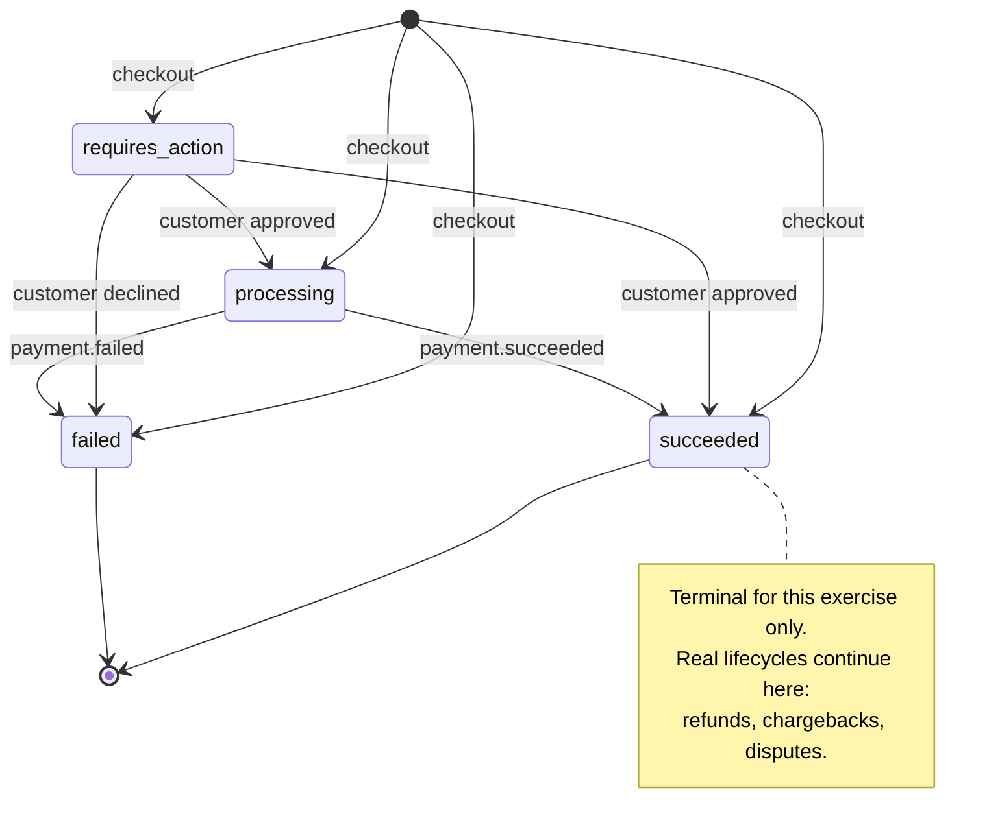
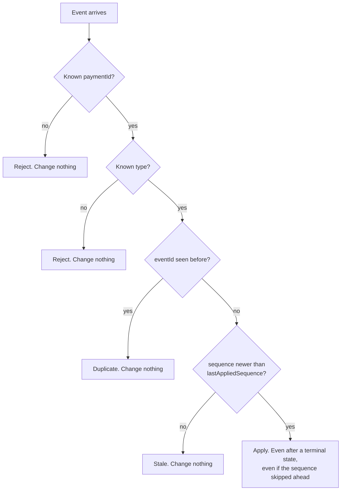

# 📜 Payment and entitlement contracts

Every type in this document lives in `packages/lab-core/src/contracts/index.ts`. This page explains the reasoning; the file is the source of truth.

## 💳 Payment state

The application server owns payment state. The browser reads it and never sets it.

```
PaymentStatus = 'requires_action' | 'processing' | 'succeeded' | 'failed'
```



| State | What it means |
| --- | --- |
| `requires_action` | The provider needs something from the customer: a bank app approval, a 3-D Secure step. In the contract, deliberately not produced by any [scenario](./chaos-scenarios.md) |
| `processing` | Accepted for processing. The provider took the instruction and will report the outcome later. Not a slow success. It can still fail |
| `succeeded` | The provider says the payment went through |
| `failed` | A known, reported failure, carrying a `failureCode` |

`succeeded` and `failed` are terminal *for this exercise*. They are not terminal in real life. Refunds, chargebacks and disputes all arrive after a success, which is why the event rules below version state instead of freezing it.

**And a succeeded payment is not a settled one.** Settlement happens on the provider's own schedule, money can be pulled back afterwards, and none of that is modelled here.

## 🌐 What the browser gets back

```ts
type ApiResult<T> =
  | { ok: true;  data: T }
  | { ok: false; kind: 'timeout' }
  | { ok: false; kind: 'network' }
  | { ok: false; kind: 'not_found' }
  | { ok: false; kind: 'http'; status: number };
```

The rule that makes this work:

| What happened | HTTP | Shape the browser sees |
| --- | --- | --- |
| Payment succeeded | 200 | `{ ok: true, data: { status: 'succeeded' } }` |
| Payment declined | 200 | `{ ok: true, data: { status: 'failed' } }` |
| Accepted for processing | 200 | `{ ok: true, data: { status: 'processing' } }` |
| Request was malformed | 400 | `{ ok: false, kind: 'http', status: 400 }` |
| No such purchase | 404 | `{ ok: false, kind: 'not_found' }` |
| Browser gave up waiting | none | `{ ok: false, kind: 'timeout' }` |
| Connection dropped | none | `{ ok: false, kind: 'network' }` |

A decline is a successful request carrying bad news. A 4xx means you asked wrongly, never that the payment failed. The browser waits `CLIENT_TIMEOUT_MS` (3 seconds) before giving up, using `AbortSignal.timeout`.

## 🔑 Purchase identity and idempotency

```ts
type Purchase = {
  purchaseId: string;   // minted in the browser, stable across retries and reloads
  workspaceId: string;
  planId: 'team-monthly';
  amountMinor: 2000;    // EUR 20.00 before applicable tax
  currency: 'EUR';
  paymentId: string | null;
  createdAt: string;
};
```

The purchase id is minted once by the browser, kept in `localStorage`, and mirrored into the URL as `?purchase=`. The URL copy exists so a customer can come back, or send themselves the link. **It is a lookup key, not an authority.** The server confirms what it means.

`POST /api/checkout` is keyed on `purchaseId` alone:

- an existing non-failed payment for that purchase is returned as-is, no second payment is created,
- if the latest payment is `failed`, a retry creates a new attempt under the same purchase.

The disabled submit button is a courtesy. The server check is the protection, because a browser can always send the request again: a refresh, a flaky connection, an impatient customer, a retrying proxy.

## 📬 Provider events, ordering and versioning

```ts
type ProviderEvent = {
  eventId: string;      // the idempotency key
  paymentId: string;
  type: 'payment.processing' | 'payment.succeeded' | 'payment.failed';
  sequence: number;     // per payment, monotonic
  occurredAt: string;
  failureCode?: FailureCode;
};
```

`packages/lab-core/src/server/events.ts` applies these rules in order, and every one of them writes a timeline row:

| Case | Rule | Timeline |
| --- | --- | --- |
| `paymentId` is unknown | reject, change nothing | `rejected_unknown_payment` |
| `type` is unknown | reject, change nothing | `rejected_unknown_type` |
| `eventId` has been seen | ignore | `ignored_duplicate` |
| `sequence <= lastAppliedSequence` | ignore, but remember the event id | `ignored_stale` |
| `sequence > lastAppliedSequence + 1` | apply anyway, note the gap | `applied` |
| anything newer, including after a terminal state | apply | `applied` |



**Guarantees this gives you.** Duplicate delivery is a no-op. Out-of-order delivery cannot move state backwards. A gap does not block: the newest version wins and nothing is buffered waiting for an event that may never arrive. Two events with the same sequence describe the same state, so the second one is stale by definition.

**The rule we deliberately did not write.** "Ignore any event once the payment is terminal" passes every scenario in this lab and is wrong. Real lifecycles continue past success: `payment.refunded`, `dispute.created`, `dispute.won`. A blanket post-terminal rule silently drops them. Order by version, not by a guess about whether you are finished.

**What this simulation does not guarantee.** There is no delivery retry with backoff, no signature verification, no queue, no at-least-once contract across process restarts. Scheduled events live in memory: restart the dev server and anything undelivered is gone. Real webhook infrastructure is a large part of the work and none of it is the point here.

## 🔓 Entitlement

```ts
type Entitlement = {
  workspaceId: string;
  access: 'none' | 'active';
  reason: 'no_payment' | 'payment_processing' | 'payment_failed'
        | 'payment_for_other_workspace' | 'payment_succeeded';
  grantedByPaymentId?: string;
  decidedAt: string;
};
```

**This exercise's business policy, stated deliberately:**

> Access is `active` only when the server can see a succeeded payment that belongs to this workspace **and** whose purchase also belongs to this workspace. A processing payment grants nothing. A redirect, a query parameter and a button click grant nothing.

Other products choose differently, and reasonably: provisional access while a bank debit clears, a grace period after a failed renewal, a trial that outlives a failed payment. The policy is a product decision. What is not negotiable is where it gets decided. `decideEntitlement` runs on the server, the browser renders the answer, and the frontend has no way to set either payment or entitlement state.

The entitlement is recomputed on every read rather than stored as a flag, which is what leaves room for the refund that this lab does not simulate.

## 🚧 Deliberately out of scope

Refunds, disputes, chargebacks, settlement and payouts, reconciliation, invoicing and tax calculation, proration, dunning and retries on renewal, multi-provider routing, provider SDKs, authentication of the customer, and real money of any kind.
