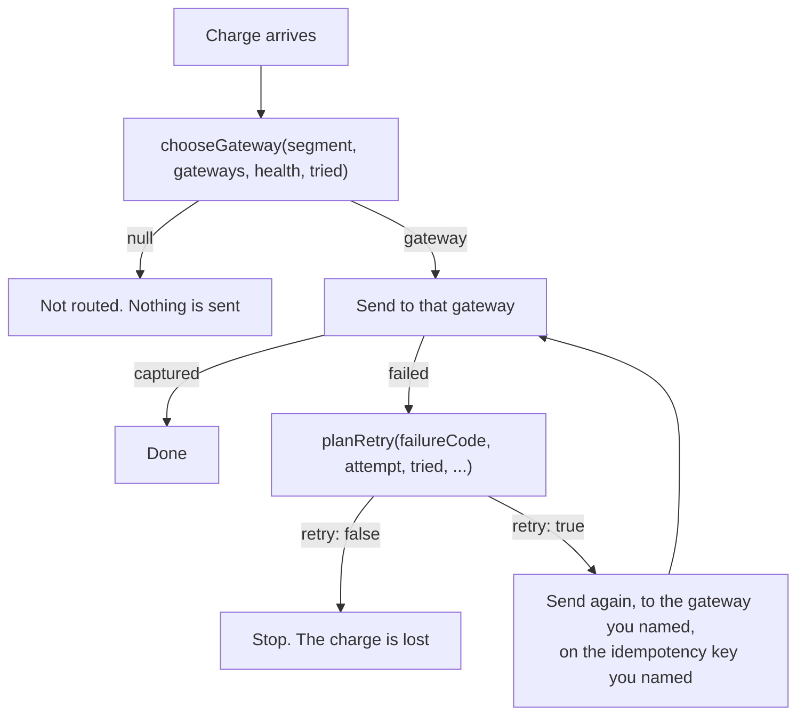

# Exercise 01: the game day

You are on call for Bigpdf payments. Traffic is flowing, the overall authorisation rate is
94%, and in a few minutes somebody is going to break a gateway on purpose while you watch.

Your job is to get the money moving again, using an orchestrator you write.

## 🎯 What you'll learn

- Why an overall success rate hides an outage, and what to look at instead.
- Why eligibility comes before preference: a gateway that cannot take SEPA is not a fallback.
- Which failures may be retried elsewhere, which must never be, and why the failure code is
  the only thing that answers that.
- What an idempotency key is actually for.

## ⏱ Time

About 25 minutes. Two functions, one file each.

## 🔌 Run it

```bash
pnpm exercise 01     # http://localhost:3001
```

Traffic starts as soon as the console is open, at five attempts a second across five
segments. It is seeded, so everyone in the room sees the same run and a reset replays it.

## 🧠 What is in front of you

A charge goes through the orchestrator, which asks your code two questions.



Three gateways, and they are not interchangeable:

| Gateway | Accepts | Baseline | Fee | Notes |
| --- | --- | --- | --- | --- |
| Atlas | Card EUR, Card GBP | 94% | 1.45% | The primary |
| Borealis | Card EUR, SEPA EUR | 92% | 1.20% | No sterling at all, and the only home SEPA has |
| Cirrus | Card EUR, Card GBP | 88% | 2.10% | Break glass. Authorises less, costs more |

Five segments take live traffic: card in Germany and France in euro, card in Britain in
sterling, SEPA debit in Germany and France.

## 📋 Your task

Two files, in `01.problem.game-day/src/lab/`. Both are pure functions: they take plain
values and return plain values, and the orchestrator does exactly what they say.

🦆 marks a task. 🧾 marks background you do not need to change. 💰 marks a hint, and they
all live in [`01.problem.game-day/HINTS.md`](./01.problem.game-day/HINTS.md).

**🦆 Task 1, `routing.ts`.** `chooseGateway` currently sends everything to whichever gateway
is first in the table. Make it ask three questions in order: what can accept this at all,
what is healthy for *this segment*, and what does priority say. Returning `null` is a real
answer when nothing eligible is left.

**🦆 Task 2, `retryPolicy.ts`.** `planRetry` currently retries everything, on the gateway
that just failed, with a fresh idempotency key. Make the failure kind decide, and when you
do retry, carry the charge's original key.

Start with task 1. Task 2 is easier once routing works, and it can reuse `chooseGateway`.

## 🌪 Run the game day

1. Open the console and let it settle. Nobody has broken anything yet and two segments are
   already on the floor: both SEPA tiles sit at zero and "Misrouted" climbs, because the
   starter sends every payment to the first gateway in the table and Atlas has no SEPA.
2. Get the eligibility half of task 1 working. Both SEPA tiles come back and the headline
   settles around 94%. Files are hot reloaded, so the next attempt already uses your code.
3. Switch on **Atlas is down for German cards** in the chaos panel.
4. Watch the headline rate and the German card tile fall by very different amounts. German
   cards are about a third of the traffic and the other four segments are untouched, so the
   headline looks like a bad afternoon while that one tile drops to roughly a fifth of its
   normal rate. That gap is the whole lab.
5. Finish task 1 by reading health for *this segment*. German cards move to Borealis, the
   tile comes back to the mid eighties, and British cards stay on Atlas.
6. Fix task 2. Declines stop being retried, retries stop going back to the gateway that
   just refused them, and the key on the retry rows in the attempt feed stops changing.
7. Switch on **Borealis drops German SEPA debits**. There is nowhere to fail over to. Decide
   what your code should do about that, then check it does it.

## ✅ You'll know you're done when

- [ ] SEPA debits only ever reach Borealis, and "Misrouted" stays at zero.
- [ ] With the Atlas fault on, German cards recover to roughly their normal rate.
- [ ] British cards stay on Atlas throughout, because that segment was never in trouble.
- [ ] A declined card makes one attempt, not three.
- [ ] Every retry row in the attempt feed carries the same key as the attempt it retried.
- [ ] `pnpm test:exercise 01` reports no remaining failures.

```bash
pnpm test:exercise 01     # your progress, one line per task
pnpm compare 01           # starter on 3001, reference on 3002, separate state
```

## 🤔 Worth arguing about

The reference keeps sending SEPA to Borealis while Borealis is failing, because there is
nowhere else and a degraded gateway still authorises some payments. The alternative is to
stop and queue. One of those choices annoys customers today; the other loses revenue today
and annoys them tomorrow. Neither is obviously right, and it is a product decision rather
than an engineering one.
