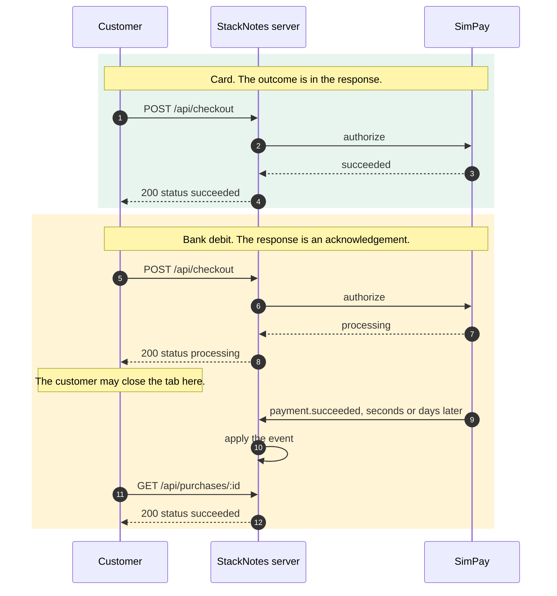

# Exercise 01: One checkout, two payment timelines

You are on the StackNotes growth team. StackNotes sells one plan: **€20.00 per workspace per month, before applicable tax**. Checkout has been live for a week and support is not happy.

> "I paid by bank debit and the page said *Payment received*. Two minutes later my workspace was still locked. Which one is true?"

> "I refreshed while it was confirming and got an empty checkout page. Did my payment disappear?"

> "A colleague sent me a link with `?paid=1` on the end and it unlocked the workspace. Is that supposed to happen?"

Nothing is wrong with the payment provider. The server knows exactly what happened to every payment. The frontend is telling a different story.

## 🎯 What you'll learn

- How to tell **a payment that failed** apart from **a request you never got an answer to**, and why shipping that difference matters.
- Why *accepted for processing* is its own state, not a slow version of success.
- How to recover the real state after a reload, a closed tab, or a link someone else sent.
- Why access has to come from a decision your server made.

## ⏱ Time

About 25 minutes. Three small fixes in three files.

## 🧠 The problem

One checkout, two timelines behind it.



The second timeline is where frontends go wrong, because the code was written for the first one. A checkout that knows only "paid" and "failed" has to squeeze four real states and one non-answer into two buckets, and everything it squeezes is a support ticket.

One thing worth stating before you start. This lab grants workspace access only after the server has verified a **succeeded** payment for the right workspace and the right purchase. Pending grants nothing. That is a business policy chosen for this lab, not a law of nature. Plenty of real products grant provisional access while a bank debit clears, or keep a grace period after a failure. Pick a policy deliberately, then make the code say it out loud.

## 🗺 Files you'll work in

Three files in `01.problem.two-timelines/src/lab/`. All three are plain functions taking plain values and returning plain values. No components, no styling, no fetching. The interface renders whatever your functions return.

| File | Its job |
| --- | --- |
| `paymentView.ts` | Turn what the server said into what the customer reads |
| `restoreCheckout.ts` | Find the purchase again after a reload or a return visit |
| `accessDecision.ts` | Decide whether the workspace shows locked or unlocked |

🦆 marks a task. 🧾 marks background you do not need to change. 💰 marks a hint, and they all live in `01.problem.two-timelines/HINTS.md`.

Everything else is built for you: the simulated provider, the payment store, event delivery and de-duplication, idempotent checkout, the scenario panel, the reset, and the event timeline.

## 📋 Your task

Reproduce the tickets first. Pick **Bank debit is accepted, then succeeds** in the control panel, pay with bank debit, and watch the status panel next to the event timeline. The timeline is the server talking. The panel is your code talking. They disagree.

**🦆 Task 1, `paymentView.ts`.** Return a view that matches what the server reported. A processing payment is pending and worth polling for, a declined payment is a failure worth retrying, and a request that timed out or lost its connection is neither. `ApiResult` is `{ ok: true, data }` when the server answered and `{ ok: false, kind }` when it did not. A decline is an `ok: true` carrying `status: 'failed'`.

**🦆 Task 3, `accessDecision.ts`.** The function gets three inputs and only one of them decided anything on a server. Return a decision based on `entitlement.access`, and use `entitlement.reason` for the explanation. While the entitlement is still `null`, say you are checking rather than guessing.

**🦆 Task 2, `restoreCheckout.ts`.** Find the purchase id the customer already has, in the URL or in localStorage, and ask the server what state it is in with `context.api.getPurchase(id)`. A `not_found` means start fresh. A timeout means keep the id and admit you do not know yet. Nothing in the query string is proof of payment.

> Those are in the order worth working in, which is not the order they are numbered. Task 3 is cheapest and carries the business rule. Task 2 is largest, so leave time for it. The numbers match the 🦆 comments and the labels in `pnpm test:exercise 01`.

## ✅ You'll know you're done when

- [ ] **Bank debit is accepted, then succeeds** shows a confirming state, not a success, and "Server payment state" reads `processing`.
- [ ] That page becomes a success on its own once the event lands. Use **Deliver events now** rather than waiting six seconds.
- [ ] Reloading while it is confirming shows the same purchase, still confirming.
- [ ] `/?status=success` shows no payment at all.
- [ ] **Bank debit is accepted, then fails** ends on a failure.
- [ ] **Payment succeeds, the browser gives up waiting** never claims the payment failed, and settles on success by itself.
- [ ] The workspace stays locked while the payment is processing, and unlocks only when the entitlement reads `active`.
- [ ] `/workspace/ws_northstar?paid=1` unlocks nothing.
- [ ] `pnpm test:exercise 01` reports all three tasks done.

## 💡 Hints

Three levels per task in [HINTS.md](./01.problem.two-timelines/HINTS.md). Take them one at a time.

Two that save the most time:

- Read the **event timeline** while you work. It is the server's own account of what it did, it polls independently of your code, and it does not lie.
- "Server payment state" and "Asking the server" show what your mapper decided. If it is not asking while a payment is processing, the screen will never hear the good news.

## 🔌 How to run

```bash
pnpm exercise 01      # starter, http://localhost:3001
pnpm solution 01      # finished, http://localhost:3002
pnpm compare 01       # both at once
pnpm test:exercise 01 # your progress, per task
pnpm reset 01         # clear the simulated state
```

Port taken? `pnpm exercise 01 --port 4001`.

Finished? [FINISHED.md](./FINISHED.md) has the stretch goals.
