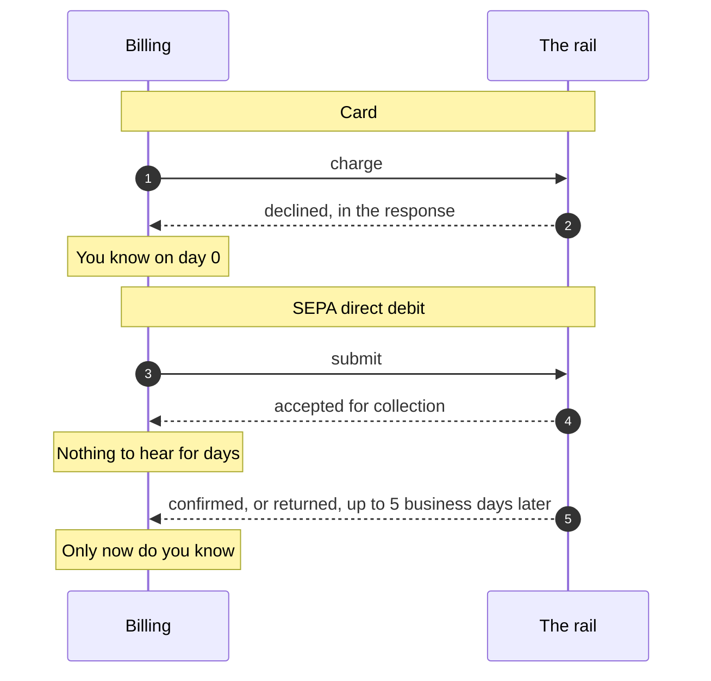

# Exercise 02: the grace period

Support has forwarded you an email.

> "You suspended our workspace on Tuesday and told us our payment failed. I have the bank
> statement here. The money left our account on the Monday. What exactly failed?"

Nothing failed. The customer pays by SEPA direct debit, the debit was submitted on the due
date, and the bank confirmed it four days later, which is how that rail works. Billing gave
them 24 hours, because 24 hours is how long a card takes.

## 🎯 What you'll learn

- Why a grace period is a property of the payment rail and not of the customer.
- What "no news" means on a rail that can take five business days to answer.
- Why a bank return should be acted on the day it arrives, even with a week of window left.
- What suspending the wrong account actually costs, which is more than the invoice.

## ⏱ Time

About 25 minutes. Two functions, one file each.

## 🔌 Run it

```bash
pnpm exercise 02     # http://localhost:3003
```

Nothing moves until you move it. The console has a clock, and the billing job runs every
time the clock does.

## 🧠 What is in front of you

Three accounts, one invoice each, all due on day 0. Day 0 is a Monday, which matters.

| Account | Pays by | What is actually happening |
| --- | --- | --- |
| Acme | Card | The card was declined on day 0. Genuinely unpaid |
| Northstar | SEPA debit | Submitted on day 0. The bank confirms on day 4. Nothing is wrong |
| Harbour | SEPA debit | Submitted on day 0. The bank returns it on day 2. Genuinely unpaid |

The two rails answer on completely different schedules.



Every time the clock moves, billing asks your two functions what to do, then does it.

## 📋 Your task

Two files, in `02.problem.grace-periods/src/lab/`. Both are pure functions.

🦆 marks a task. 🧾 marks background you do not need to change. 💰 marks a hint, and they
all live in [`02.problem.grace-periods/HINTS.md`](./02.problem.grace-periods/HINTS.md).

**🦆 Task 1, `graceWindow.ts`.** `graceWindowFor` gives every invoice 24 hours from the due
date. Make the window depend on the rail: 24 hours for a card, five **business** days from
submission for a SEPA debit. Weekends are not banking days, and day 0 is a Monday precisely
so that a calendar day version lands on a Saturday and is wrong.

**🦆 Task 2, `dunningDecision.ts`.** `decideDunning` ignores the window it was handed and
ignores what the payment is doing. Make the rail's answer come first, then the clock. Remind
before you suspend, and clear dunning when the money turns up.

Task 1 first. Task 2 is where it pays off, and until task 2 reads `input.window` your fixed
window changes nothing.

## 🌪 Run it through

1. Open the console. Day 0, three accounts, nobody chased.
2. Advance to day 2. Northstar is suspended and told its payment failed, while its money is
   in transit. That is the email at the top of this page.
3. Fix task 1. Northstar's window moves to the following Monday. Nothing else changes yet,
   which is the point: the decision is not reading it.
4. Fix task 2. Advance through the week and watch Northstar stay untouched, Acme get chased
   the next day, and Harbour get chased on day 2 when its bank actually answers.

## ✅ You'll know you're done when

- [ ] Northstar is never reminded and never suspended, on any day.
- [ ] Acme is reminded once its 24 hours are up, and suspended two days after that.
- [ ] Harbour is chased from day 2, when the bank returns the debit, not from day 8.
- [ ] Nobody is suspended without a reminder first.
- [ ] `pnpm test:exercise 02` reports no remaining failures.

```bash
pnpm test:exercise 02     # your progress, one line per task
pnpm compare 02           # starter on 3003, reference on 3004
```

## 🤔 Worth arguing about

Five business days is the scheme's return window, so it is the earliest moment you can be
confident. It is also nearly a week of unpaid product. A real business might chase sooner
with a softer message, or suspend on the second failed cycle rather than the first. What is
not defensible is the starter's version: a number chosen for one rail, applied to another,
and never revisited.
